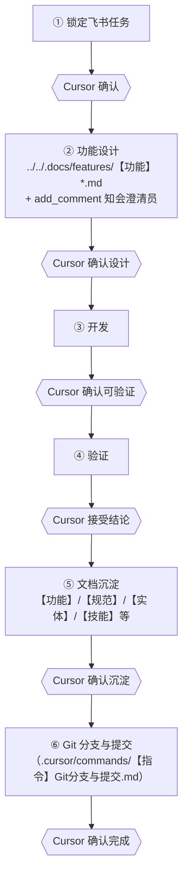

# 飞书项目需求驱动开发与测试环境交付流程（order-center）

聊天中触发：**`/【指令】飞书项目需求驱动开发与测试环境交付流程`**（名称较长时在 `/` 列表中搜索「飞书」或「交付」）。

**权威全文**：`../../.docs/specs/【规范】飞书项目需求驱动开发与测试环境交付流程.md`。
**规则摘要**：`.cursor/rules/【规范】飞书项目需求驱动开发与测试环境交付流程.mdc`。
**配套技能**：`feishu-project-mcp`、`.cursor/skills/【技能】飞书项目MCP/SKILL.md`；`spec-dd-feature`；`git-branch-commit-oc`。待办列表策略见 `feishu-mcp-unmet-requirements`（仍须在第一步锁定唯一工作项）。

### 整体流程（分步门禁）

**每步进入下一步前，须在 Cursor 会话中人工确认**；第二步在 **`../../.docs/features/【功能】*.md` 初稿就绪后须用 MCP `add_comment` 在工作项下评论知会澄清员**（见第二步正文），**不替代**该确认。

### 本指令触发时：先判断「当前在第几步」

- **尚未锁定飞书任务**（无法从对话判断已确认「就做这一条」）：**只做第一步**——问 **要处理的是哪个需求（飞书工作项）？** 并请至少一项：**工作项 ID**、**工作项链接（URL）**、或 **空间 + 类型 + 标题/关键字**（可唯一检索）。在负责人**尚未给出**任何可定位输入前，不要调用飞书 MCP（为拉取第二步详情的调用）、不要写 `../../.docs/features/`、不要做第 2～6 步。用户**一旦**给出可定位信息且已**唯一确定**工作项后，**须**调用 MCP 展示含**澄清员**与 **功能/业务流程说明**（摘要 + 必要时表下摘录）的 **步骤 1 锁定确认框**（见 **`../../.docs/specs/【规范】飞书项目需求驱动开发与测试环境交付流程.md`**），再请用户确认锁定。
- **已在流程中的某一步**（对话/上下文能判断当前是第 2～6 步，或用户明示「现在在第 N 步」）：**只索取该步所需输入或确认**，不要从第一步重新问「哪个需求」。缺什么就问什么，例如：
  - 第 2 步：设计稿未定稿 → 请用户审阅 `../../.docs/features/【功能】*.md` 并在 **Cursor 会话**中确认；若尚未执行，**须**用 **`add_comment`** 在工作项下**大致做法描述**知会**澄清员**（与第二步正文一致，不替代会话确认）。
  - 第 3 步：缺实现依据 → 确认已锁定的【功能】/【规范】路径或待澄清点。
  - 第 4 步：缺验证结论 → 请用户确认是否接受当前验证摘要，或补充要跑的命令/环境。
  - 第 5 步：在第四步已确认「验证结论可接受」后，补齐 **`../../.docs/features/`**、**`../../.docs/specs/`**、**`../../.docs/entity/`**、**`.cursor/skills/`** 等与本次交付相关的 md 沉淀（见第五步正文）；待用户确认「文档沉淀可接受」后再做第 6 步。
  - 第 6 步：在第五步已确认后，按 **`.cursor/commands/【指令】Git分支与提交.md`** 代为完成分支（若在主干）与 **`commit-msg.txt` + `git commit -F`**；推送仅当用户明确要求。

在**仓库根目录**按下列流程**代为执行**。**分步门禁**：**仅当**上一步已在对话中得到**人工确认**，且**本步所需输入**已具备，**方可执行本步**；缺输入或缺确认时**停止推进**、向用户索取，**不得**串联跳步；**不得**跳过「锁定任务」「确认功能设计」。

### 分步：进入本步须具备 → 进入下一步前须确认

| 步 | 进入本步须具备 | 进入下一步前须用户人工确认 |
|----|----------------|----------------------------|
| 1 | 用户给出任务定位**输入**（ID / URL / 可唯一检索信息）；Agent 展示**步骤 1 锁定确认框**（含澄清员、功能/业务流程说明摘要及必要时表下摘录，见规范） | 确认「锁定本条任务」后 → 才做第 2 步 |
| 2 | 第 1 步已确认的任务标识 | **`add_comment`**（大致做法即可）+ **`../../.docs/features/【功能】*.md`**；在 **Cursor 会话**中确认文档内容后 → 才做第 3 步 |
| 3 | 第 2 步已确认的设计稿及必要 **`../../.docs/specs/【规范】*.md`** | 确认「可进入验证」后 → 才做第 4 步 |
| 4 | 第 3 步已认可的实现 | 确认验证结论可接受后 → 才做第 5 步 |
| 5 | 第四步已确认验证结论 | **文档沉淀**（【功能】修订、【规范】/【实体】/【技能】等按需更新）；确认「文档沉淀可接受」后 → 才做第 6 步 |
| 6 | 第五步已确认文档沉淀 | 按 **【指令】Git分支与提交** 完成提交（及视情况新建分支）；用户确认收尾后 → 流程结束 |

## 第一步：输入 —— 锁定飞书任务

1. **在用户提供**至少一项**输入**前，不进入复述与锁定：**工作项 ID**、**飞书工作项 URL**、或 **空间 + 类型 + 标题/关键字**（可唯一检索）。
2. **仅工作项 ID 时的一步拉取（避免绕路）**：用户只给数字 **ID**、未给链接时，**不要**先试「只传 `work_item_id`」的 **`get_workitem_brief`**——当前 MCP 常返回 **`project_key is empty`**。**应首调即**传入 **`work_item_id` + `project_key`**：任务在 **IT-项目** 时，`project_key` 与 **`../../.docs/features/`** 文首「飞书空间」表一致（示例 **`63b62b98fc2c567f7212856d`**，以仓库文档为准）。用户若提供 **飞书工作项 URL**，通常可由工具解析出 `project_key`，一般同样可一次调通。**首调还须传 `fields`**（至少 **`description`**，及规范第一步所列常用 field_key），否则接口不返回描述正文，容易再调第二次 `get_workitem_brief`。细则与兜底见 **`../../.docs/specs/【规范】飞书项目需求驱动开发与测试环境交付流程.md`** 第一步。
3. 已能唯一确定工作项后、请用户确认锁定**之前**：**单次**调用 **`get_workitem_brief`**（`project_key` 或 `url` + **`fields`**），按规范从 **`role_members`** 解析 **澄清员**，从 **`fields`（至少 `description`）** 填 **功能/业务流程说明**；**勿**先无 `fields` 拉 brief 再补拉，**勿**默认先 **`get_node_detail`**（多 **工作事项** 会 **`Workflow Not Found`**）。仅当首调仍缺字段时，再用 **`list_workitem_field_config`** / 二次 **`get_workitem_brief`** / **`get_node_detail`** 兜底。与名称、ID、空间、状态、排期等一并填入 **「步骤 1 锁定确认框」**（Markdown **表格**，**须含「澄清员」「功能/业务流程说明」列**；说明列宜为**短摘要**，较长正文放在表下 **「功能/业务流程说明（摘录）」**；无则填「—」）。
4. **展示确认框并待用户明确确认**（如「锁定本条任务」）后再进入第二步；勿仅口头复述标题代替表格（除非负责人要求简化）。
5. 可选产出：`../../.docs/input/【输入】*.md`（非强制）。

## 第二步：拉取需求 —— 功能设计文档

1. 调用 **飞书项目 MCP** 前，在 `mcps/user-FeishuProjectMcp/tools/*.json` 或 Cursor MCP 界面**查阅工具 schema**；按需使用如 `get_workitem_brief`、`get_node_detail`、`search_by_mql`、`list_deliverables`、`list_workitem_comments` 等。
2. 将详情、交付物、评论要点写入 **`../../.docs/features/【功能】{简述}.md`**（目录须为 **`../../.docs/features/`** 复数，**勿**用 `.docs/feature`）；须含**需求来源与飞书工作项对应关系**；附件无法经 MCP 读取时列出名称与链接并标注人工核对处。
3. **知会澄清员（须执行）**：在 **`../../.docs/features/【功能】*.md` 初稿已写入仓库后**，**须**调用飞书 MCP **`add_comment`**（传入 **`project_key`**、**`work_item_id`**，与第一步锁定的工作项一致），在工作项下新增一条**评论**。评论**只需大致做法描述**即可：如**短摘要**、打算怎么做、关键落点；**可**附仓库内文档相对路径（有权限者自开）。澄清员无仓库时，除路径外有一段能读通的简述即可，**不必**在评论里展开与【功能】正文同级的范围/验收/待澄清等逐项细节（细节以仓库 **`../../.docs/features/`** 为准）。宜用**纯文本或简单换行**；若接口报错则改简或分段重试。**若 `add_comment` 失败**，须在对话中说明并提示负责人手动补评；更细同步由负责人**按需**用云文档、PDF、会议等**自行补充**。**仅为同步知会**，**不替代**下一步的 Cursor 确认。
4. **待用户在 Cursor 会话中审阅并确认**该功能设计文档后，再进入第三步。

## 第三步：开发

1. **仅在**第二步功能设计已由用户**确认**后执行；以已确认的 **`../../.docs/features/【功能】*.md`** 及必要 **`../../.docs/specs/【规范】*.md`** 为准；遵循 Spec-DD、实体文档同步（若改实体）、**`git-branch-commit-oc`** 分支与提交规范。
2. **不扩大需求范围**。
3. **进入第四步前**须用户在对话中**明确确认**可进入验证（如「开发结果可进入验证」或等价表述）。

## 第四步：验证

1. 按需运行单测、Maven `test`/`verify` 等；对话中给出**验证摘要**。
2. 可选：`../../.docs/reports/【报告】*.md`。
3. **待用户确认**验证结论可接受后，再进入**第五步（文档沉淀）**。

## 第五步：文档沉淀

**须在第四步**用户已确认「验证结论可接受」**之后**执行；**在第六步 Git 提交之前**，将本次交付相关的仓库文档与 Agent 技能**对齐实现**，便于后续检索与复用。细则见 **`../../.docs/specs/【规范】飞书项目需求驱动开发与测试环境交付流程.md`** §4 **第五步**正文及 §2.4。

1. **【功能】**：更新已锁定的 **`../../.docs/features/【功能】*.md`**——**修订记录**、与代码一致的实现要点、验收或已知限制；若第二步初稿与落地有差异，须写明。
2. **【规范】/【实体】**：若本次改动涉及契约或持久化模型，同步 **`../../.docs/specs/【规范】*.md`**、**`../../.docs/entity/【实体】*.md`**（遵循 **【规范】实体与文档同步**）。
3. **【技能】**：若本次能力影响 Agent 工作流（如 oc-web 页面范式、平台店铺开发步骤），按需更新 **`.cursor/skills/**/SKILL.md`**（命名与分类见 **【规范】文档命名与分类**）。
4. **其它**：可选 **`../../.docs/guides/【指南】*.md`**、**`../../.docs/reports/【报告】*.md`**（与第四步验证留档可合并或互补）。
5. **待用户确认**本步结果（如「文档沉淀可接受」或等价表述）后，再进入**第六步**。

## 第六步：Git 分支与提交

**须在第五步**用户已确认「文档沉淀可接受」**之后**执行。完整步骤与 PowerShell 示例见 **`.cursor/commands/【指令】Git分支与提交.md`**；技能 **`git-branch-commit-oc`**（`.cursor/skills/【技能】Git分支与提交/SKILL.md`）。执行该指令时**须包含**其中的 **「提交前文档沉淀确认」**：对照 `git diff` 与第五步已写文档，若仍有缺口须请用户选择补全 / 跳过 / 已他处沉淀（第五步已对齐时通常可选「无需再补」并简要说明）。

1. **`git branch --show-current`**：若当前为 **`master`** / **`main`**，先按规范 **`branch-name.txt`（UTF-8）** 建功能分支再提交；若已在 **`feat/`**、**`fix/`** 等分支上，**不要**再 `checkout -b`。
2. 撰写 **`commit-msg.txt`（UTF-8）**，使用 **`git commit -F commit-msg.txt`**；**不要**将 `branch-name.txt` / `commit-msg.txt` 提交入 Git（见 `.gitignore`）。
3. **推送**仅当用户在对话中**明确要求**时执行（`git push` / `git push -u origin <分支>`）。
4. **待用户确认**本步结果（提交已完成或接受当前状态）后，**本流程第六步结束**。

**测试环境部署（Jenkins 等）**：不再作为本流程第六步的必做项；若团队仍需触发构建，由负责人在推送后**自行**使用 Jenkins 或等价渠道，**勿**将 Token、密码写入仓库。

## 不要做的事

- **不要**在缺少「本步所需输入」或缺少「上一步人工确认」时执行本步；**不要**未经用户逐步确认串联六步或跳过门禁；**不要**在已处于第 2～6 步时无故回到第一步重问任务（换任务或用户要求重来除外）。
- **不要**将 **`.cursor/mcp.json`** 令牌或 Jenkins 凭据写入仓库。
- **不要**把功能设计落在错误路径（须 `../../.docs/features/` + `【功能】*.md`）。

## 与用户交互

若当前步**输入不齐**或**上一步未确认**或用户未明确「进入下一步」，须**停顿**，列出**尚缺输入**或**需确认事项**，待用户补齐并明确确认后再继续。
若上下文已表明**正处在第 2～6 步**，优先只问**该步**所需输入或确认，**不要**无故回到第一步重问「哪个需求」（用户要求换任务或从头重来时除外）。
